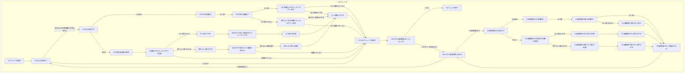

# ゲームの流れ（COフェイズ）

```mermaid
flowchart TD

subgraph COフェイズ
COフェイズ開始 --> PCはCO可能か?

PCはCO可能か? -->|生存&CO可能役職&今日は未CO| PCはCO済みか?
PCはCO可能か? -->|CO不可| PCのCOフェイズ仮完了

PCはCO済みか? -->|CO済み| PCのCO役職は?
PCのCO役職は? -->|占い師| PCの真の役職は?

PCの真の役職は? -->|占い師| 占い結果COする/しないボタン表示
占い結果COする/しないボタン表示 -->|占い結果COしない| PCのCOフェイズ仮完了
占い結果COする/しないボタン表示 -->|占い結果COする| 占い結果COする

PCの真の役職は? -->|占い師ではない| 騙り占い実行/結果COしないボタン表示
騙り占い実行/結果COしないボタン表示 -->|騙り占い結果COする| 占い結果COする
騙り占い実行/結果COしないボタン表示 -->|占い結果COしない| PCのCOフェイズ仮完了

PCはCO済みか? -->|未CO| CO可能な役職を取得
CO可能な役職を取得 --> 役職COする/しないボタンを表示
役職COする/しないボタンを表示 -->|占い師COする| 占い師COする
役職COする/しないボタンを表示 -->|騙り占い師COする| 騙り占い師COする
役職COする/しないボタンを表示 -->|役職COしない| PCのCOフェイズ仮完了

占い師COする --> 前日までの占い結果をCOしたことにする
前日までの占い結果をCOしたことにする --> 占い師CO処理
占い師CO処理 --> 占い結果COする

騙り占い師COする --> 前日までの騙り占い結果を決める
前日までの騙り占い結果を決める -->|騙り占い結果決定| 騙り占い師CO処理
前日までの騙り占い結果を決める -->|役職COしない| PCのCOフェイズ仮完了
騙り占い師CO処理 --> 占い結果COする

占い結果COする --> PCのCOフェイズ仮完了

PCのCOフェイズ仮完了 --> NPCのCO候補者はもういないか?

NPCのCO候補者はもういないか? -->|いない| COフェイズ終了
NPCのCO候補者はもういないか? -->|いるかも（初回含む）| NPCのCO候補者を決める

NPCのCO候補者を決める -->|CO候補者あり| CO候補者はCO済みか?
NPCのCO候補者を決める -->|CO候補者なし| PCはCO可能か?


CO候補者はCO済みか? -->|CO済み| CO候補者のCO役職は?
CO候補者のCO役職は? -->|占い師| CO候補者の真の役職は?
CO候補者の真の役職は? -->|占い師| CO候補者が占い結果COする

CO候補者の真の役職は? -->|占い師ではない| CO候補者が騙り占い実行
CO候補者が騙り占い実行 --> CO候補者が占い結果COする

CO候補者はCO済みか? -->|未CO| CO候補者のCO可能な役職を取得
CO候補者のCO可能な役職を取得 -->|占い師COする| CO候補者の占い師CO処理
CO候補者の占い師CO処理 --> CO候補者が占い師COする
CO候補者が占い師COする --> CO候補者が占い結果COする

CO候補者のCO可能な役職を取得 -->|騙り占い師COする| CO候補者の騙り占い師CO処理
CO候補者の騙り占い師CO処理 --> CO候補者が騙り占い師COする
CO候補者が騙り占い師COする --> CO候補者が占い結果COする

CO候補者が占い結果COする --> NPCのCO候補者を決める

end

```
