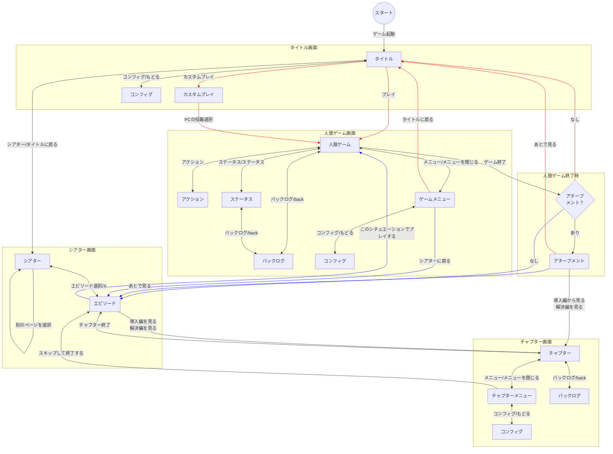

```mermaid
flowchart TD
Start((スタート))

subgraph タイトル画面
    Title[タイトル]
    CustomPlay[カスタムプレイ]
    Config[コンフィグ]
end
subgraph 人狼ゲーム画面
    MainGame[人狼ゲーム]
    Action(アクション)
    GameMenu(ゲームメニュー)
    Status[ステータス]
    GameBacklog[バックログ]
    GameConfig[コンフィグ]
end
subgraph 人狼ゲーム終了時
    IsAcheved{アチーブ<br>メント？}
    Achievement(アチーブメント)
end
subgraph シアター画面
    Theater[シアター]
    Episode(エピソード)
end
subgraph チャプター画面
    Chapter[チャプター]
    ChapterMenu(チャプターメニュー)
    ChapterBacklog[バックログ]
    ChapterConfig[コンフィグ]
end

    Start -->|ゲーム起動| Title
    Title -->|プレイ| MainGame
    Title -->|カスタムプレイ| CustomPlay
    Title <-->|シアター/タイトルに戻る| Theater
    Title <-->|コンフィグ/もどる| Config
    
    CustomPlay -->|PCの役職選択| MainGame
    
    MainGame <-->|アクション| Action
    MainGame <-->|メニュー/メニューを閉じる| GameMenu
    MainGame <-->|ステータス/ステータス| Status
    MainGame <-->|バックログ/back| GameBacklog
    MainGame -->|ゲーム終了| IsAcheved

    IsAcheved -->|なし| Title
    IsAcheved -->|なし| Episode
    IsAcheved -->|あり| Achievement
    
    Achievement -->|導入編から見る<br>解決編を見る| Chapter
    Achievement -->|あとで見る| Title
    Achievement -->|あとで見る| Episode

    GameMenu <-->|コンフィグ/もどる| GameConfig
    GameMenu -->|タイトルに戻る| Title
    GameMenu -->|シアターに戻る| Episode

    Status <-->|バックログ/back| GameBacklog

    Theater <-->|エピソード選択/X| Episode
    Theater -->|別のページを選択| Theater

    Episode -->|このシチュエーションでプレイする| MainGame
    Episode -->|導入編を見る<br>解決編を見る| Chapter
    
    Chapter <-->|メニュー/メニューを閉じる| ChapterMenu
    Chapter <-->|バックログ/back| ChapterBacklog
    Chapter -->|チャプター終了| Episode

    ChapterMenu <-->|コンフィグ/もどる| ChapterConfig
    ChapterMenu -->|スキップして終了する| Episode

%% プレイ
linkStyle 1 stroke:red
%% カスタムプレイ
linkStyle 2 stroke:red
%% PCの役職選択
linkStyle 5 stroke:red
%% ゲーム終了<br>（アチーブメントなし）
linkStyle 11 stroke:red
linkStyle 12 stroke:blue
%% あとで見る
linkStyle 15 stroke:red
linkStyle 16 stroke:blue
%% タイトルに戻る/シアターに戻る
linkStyle 18 stroke:red
linkStyle 19 stroke:blue
%% このシチュエーションでプレイする
linkStyle 23 stroke:blue
```
