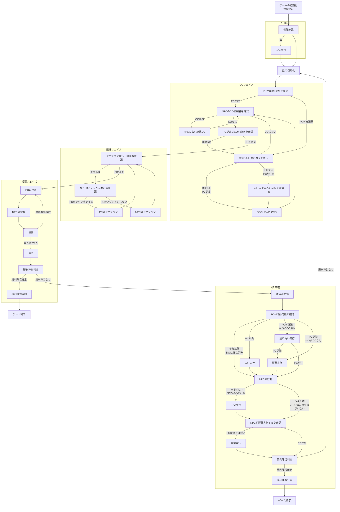

# ゲームの流れ（概略版）

```mermaid
flowchart TD

初期化[ゲームの初期化<br>役職決定] --> 役職確認

subgraph 0日目夜
役職確認 -->|占| 占い実行
end

占い実行 --> 昼の初期化
役職確認 --> 昼の初期化
昼の初期化 --> PCがCO可能かを確認

subgraph COフェイズ
PCがCO可能かを確認 -->|PCが村| NPCのCO候補者を確認
PCがCO可能かを確認 -->|PCが占狂狼| COするしないボタン表示
COするしないボタン表示 -->|COしない| NPCのCO候補者を確認
COするしないボタン表示 -->|COする<br>PCが占| PCの占い結果CO
COするしないボタン表示 -->|COする<br>PCが狂狼| 前日までの占い結果を決める
前日までの占い結果を決める --> PCの占い結果CO
PCの占い結果CO --> NPCのCO候補者を確認
NPCのCO候補者を確認 -->|COあり| NPCの占い結果CO
NPCの占い結果CO --> NPCのCO候補者を確認
NPCのCO候補者を確認 -->|COなし| PCがまだCO可能かを確認
PCがまだCO可能かを確認 -->|CO可能| COするしないボタン表示
end

subgraph 議論フェイズ
PCがまだCO可能かを確認 -->|CO不可能| アクション実行上限回数確認
アクション実行上限回数確認 -->|上限未満| NPCのアクション実行者確認
NPCのアクション実行者確認 -->|PCがアクションする| PCのアクション
NPCのアクション実行者確認 -->|PCがアクションしない| NPCのアクション
PCのアクション --> アクション実行上限回数確認
NPCのアクション--> アクション実行上限回数確認
end

subgraph 投票フェイズ
アクション実行上限回数確認 -->|上限以上| PCの投票
PCの投票 --> NPCの投票
NPCの投票 --> 開票
開票 -->|最多票が複数| PCの投票
開票 -->|最多票が1人| 処刑
処刑 --> 勝利陣営判定
勝利陣営判定 -->|勝利陣営確定| 勝利陣営公開
end

勝利陣営公開 --> ゲーム終了

subgraph 1日目夜
勝利陣営判定 -->|勝利陣営なし| 夜の初期化
夜の初期化 --> PCが行動可能か確認
PCが行動可能か確認 -->|それ以外<br>または死亡済み| NPCの行動
PCが行動可能か確認 -->|PCが占| 1日目夜_占い実行[占い実行]
1日目夜_占い実行 --> NPCの行動
PCが行動可能か確認 -->|PCが狂狼<br>かつ占CO済み| 騙り占い実行
PCが行動可能か確認 -->|PCが狼<br>かつ占COなし| 襲撃実行
騙り占い実行 -->|PCが狼| 襲撃実行
襲撃実行 --> NPCの行動
騙り占い実行 -->|PCが狂| NPCの行動
NPCの行動 -->|占または<br>占CO済みの狂狼| 1日目夜NPC_占い実行[占い実行]
NPCの行動 -->|占または<br>占CO済みの狂狼<br>がいない| NPCが襲撃実行するか確認
1日目夜NPC_占い実行[占い実行] --> NPCが襲撃実行するか確認
NPCが襲撃実行するか確認 -->|PCが狼ではない| NPC_襲撃実行[襲撃実行]
NPCが襲撃実行するか確認 -->|PCが狼| 1日目夜_勝利陣営判定[勝利陣営判定]
NPC_襲撃実行 --> 1日目夜_勝利陣営判定
1日目夜_勝利陣営判定 -->|勝利陣営確定| 1日目夜_勝利陣営公開[勝利陣営公開]

end
1日目夜_勝利陣営判定 -->|勝利陣営なし| 昼の初期化
1日目夜_勝利陣営公開 --> 1日目夜_ゲーム終了[ゲーム終了]
```
